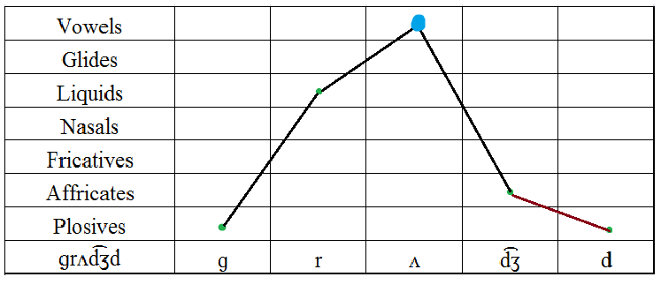

# awesome-conlanging

## Phonotactics 음소배열론

### Maximal Onset Principle 최대 음절 초성 원칙
- 자음이 앞 음절의 종성보다 뒷 음절의 초성에 붙는 경향
- 예(영어):
  - Reply [rɪ.plaɪ]
  - Admit [əd.mɪt]
    - 영어에는 /dm/ 초성이 없기 때문에, /d/가 앞 음절의 종성으로 남는다.

### Sonority Sequencing Principle 공명도 배열 원칙
- 초성에서는 공명도가 상승하고, 종성에서는 공명도가 하강해야 함
- 예외: 인구어의 /s/
  - Speak [spik]
    - 초성에서 s->p로 공명도 하강
- 공명도 척도
  - ptk < sfz < mn < lr < wj < iu < eo < a



## Math 수학

### Markov Chain 마르코프 체인
- 코퍼스에서 각 n-gram의 개수를 세고, 얻어낸 분포를 바탕으로 단어 또는 문장을 생성
- 예:
  - 시카노코 https://youtu.be/Xkq13ZthmA0
    - しかのこのこのここしたんたん
    - ```
      し -> か : 1
      か -> の : 1
      の -> こ : 3
      こ -> の : 2
      こ -> こ : 1
      こ -> し : 1
      し -> た : 1
      た -> ん : 2
      ん -> た : 1
      ん -> 끝 : 1
      ```
    - ```
      し
        -> か : 50%
        -> た : 50%

      か
        -> の : 100%

      の
        -> こ : 100%

      こ
        -> の : 50%
        -> こ : 25%
        -> し : 25%

      た
        -> ん : 100%

      ん
        -> た : 50%
        -> 끝 : 50%
      ```
  - 이름 생성기 https://www.samcodes.co.uk/project/markov-namegen/
